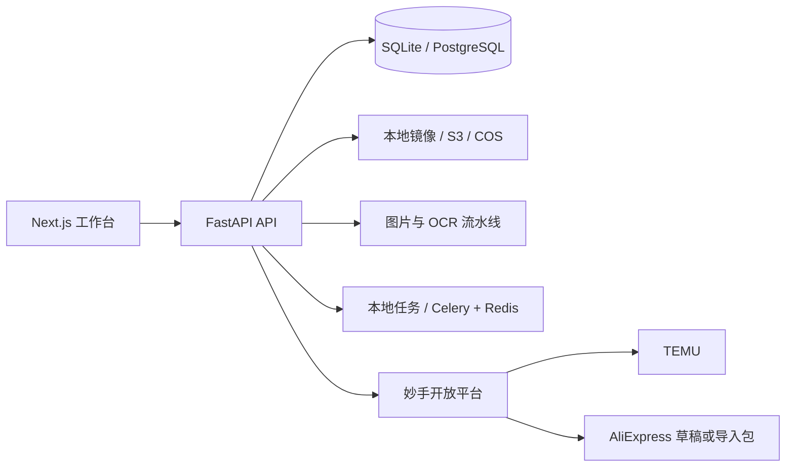

# Flow Console

> 面向女士饰品电商运营的本地商品上架工作台

Flow Console 把商品资料导入、SPU/SKU 校验、图片处理、英文文案审核、合规材料管理、店铺草稿创建和自动化运行记录放在同一套 Windows 工作流中。项目适合需要在本地控制商品数据、素材和平台发布证据的电商团队。


## 能做什么

- 从 Excel、商品文件夹或妙手本地格式 2 导入商品资料和图片，匹配 SPU、SKU、套装组件与包装图。
- 用确定性图片流水线处理白底图、尺寸图和场景图，保留输入版本、哈希、任务状态和质检结果。
- 生成并审核 TEMU、AliExpress 平台英文标题、要点和描述；审核未通过时阻止草稿创建。
- 管理 AliExpress 包装标签、REACH 报告和其他资质文件，支持图片 OCR、PDF/PPTX 文字提取与复用。
- 通过妙手开放平台同步店铺并创建草稿；TEMU 支持草稿、认领、库存保存、发布和权威状态核验。
- AliExpress 支持独立的公共采集箱草稿路径，以及明确标记为 `PACKAGE_READY` 的本地 ZIP 导入包。
- 按时区配置批量自动化任务，记录每次运行、平台、商品、外部 ID 和错误信息。

## 当前边界

TEMU 发布链路已包含权威状态核验。AliExpress 当前只创建草稿或本地导入包，不自动发布；真实公共采集箱接口仍应使用受控商品验证。`PACKAGE_READY` 只代表生成了可下载文件，不代表线上已创建草稿。

## 技术栈

| 层级 | 技术 |
| --- | --- |
| Web | Next.js 16、React 19、TypeScript、Tailwind CSS 4、lucide-react |
| API | FastAPI、Uvicorn、Pydantic、SQLAlchemy 2、Alembic |
| 数据库 | SQLite（本地默认）、PostgreSQL（部署选项） |
| 图片与 OCR | Pillow、OpenCV、NumPy、RapidOCR、rembg/BiRefNet |
| 异步任务 | 本地线程池、Celery、Redis |
| 文件与对象存储 | 本地镜像、S3 兼容存储、腾讯云 COS/CDN |
| 文档与表格 | openpyxl、pypdf、ZIP/XML 标准库解析 |
| 外部平台 | 妙手开放平台、TEMU、AliExpress、Hensun/OpenAI 兼容图片 API |
| 质量保障 | pytest、API 契约测试、TypeScript/ESLint、Next.js build |

## 架构概览



## 快速开始

环境要求：Windows 10/11、PowerShell、Python 3.10+、Node.js 20+。首次安装：

```powershell
.\安装环境.cmd
.\启动系统.cmd
```

默认地址：

| 服务 | 地址 |
| --- | --- |
| 工作台 | http://localhost:3000 |
| API | http://127.0.0.1:8000 |
| Swagger | http://127.0.0.1:8000/docs |
| 健康检查 | http://127.0.0.1:8000/health |

开发者也可以运行 `scripts\start-dev.ps1` 和 `scripts\stop-dev.ps1`。环境变量模板位于 [`apps/api/.env.example`](./apps/api/.env.example)，真实密钥只放在本机 `.env`，不要提交。

## 文档导航

- [接口文档](./docs/API.md)：HTTP 路由、参数、状态和典型调用顺序。
- [开发指南](./docs/DEVELOPMENT.md)：安装、环境变量、架构、迁移、测试和排错。
- [项目交接](./PROJECT-HANDOFF.md)：业务目标、平台验证进度、已知问题和后续工作。
- [模块验收记录](./MODULE-1-ACCEPTANCE.md)、[模块二](./MODULE-2-ACCEPTANCE.md)、[模块三至七](./MODULES-3-7-ACCEPTANCE.md)。

## 项目结构

```text
flow-console/
├─ apps/api/                 FastAPI、模型、平台适配器、任务和测试
├─ apps/web/                 Next.js 商品工作台
├─ docs/                     开发与接口文档
├─ scripts/                  启停、模板和维护脚本
├─ docker-compose.yml        PostgreSQL、Redis、MinIO
├─ PROJECT-HANDOFF.md        业务交接与验证边界
└─ README.md
```

## 验证命令

```powershell
Set-Location apps/api
& ..\..\.venv\Scripts\python.exe -m pytest -q
& ..\..\.venv\Scripts\python.exe -m compileall app tests

Set-Location ..\web
npm run lint
npm run build
```

## 安全与数据边界

- `.env`、数据库、素材、日志、依赖目录和本地模型均不进入 Git。
- 不虚构商品材质、尺寸、重量、认证或品牌信息；缺少必需数据时阻止草稿创建。
- 异步请求被接受不等于发布成功，只有平台权威查询命中才记录为 `PUBLISHED`。
- 本仓库是私有项目，未声明开源许可证。
