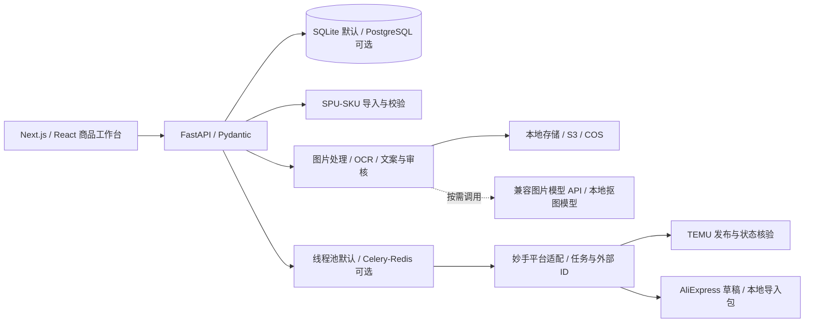

# 当前系统架构

```mermaid
flowchart LR
    U[Next.js / React 商品工作台] --> A[FastAPI / Pydantic]
    A --> DB[(SQLite 默认 / PostgreSQL 可选)]
    A --> I[SPU-SKU 导入与校验]
    A --> P[图片处理 / OCR / 文案与审核]
    P --> S[本地存储 / S3 / COS]
    P -. 按需调用 .-> AI[兼容图片模型 API / 本地抠图模型]
    A --> T[线程池默认 / Celery-Redis 可选]
    T --> M[妙手平台适配 / 任务与外部 ID]
    M --> TEMU[TEMU 发布与状态核验]
    M --> AE[AliExpress 草稿 / 本地导入包]
```

图中节点对应当前仓库代码；虚线表示可选链路，不代表已完成外部生产验收。具体取舍见[负责模块与技术决策](PORTFOLIO.md)。
